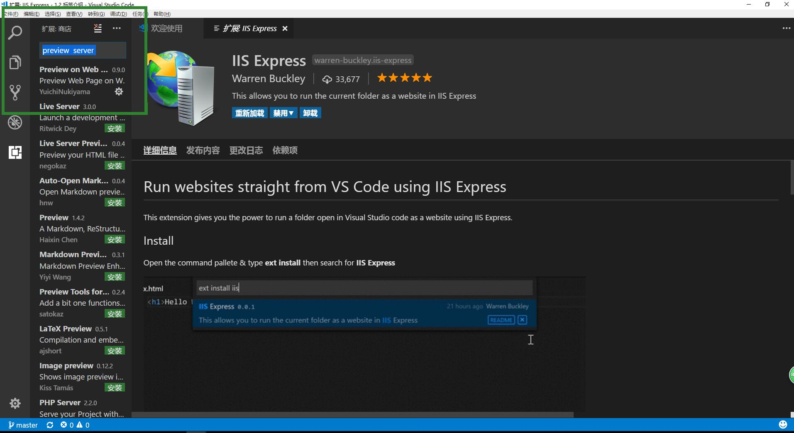
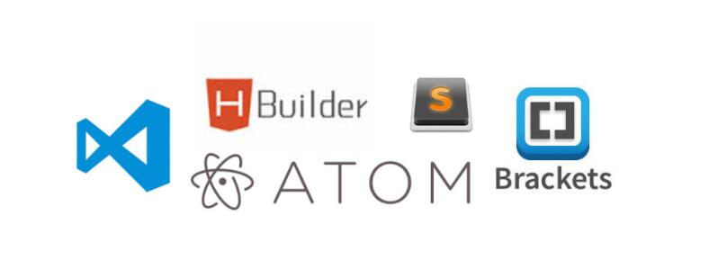

# 前端开发工程师
     前端开发工程师是一个很新的职业，
     在国内乃至国际上真正开始受到
     重视的时间是从2005年开始的，
     是指Web前端开发工程师的简称。
      Web前端开发是从美工演变而来的，
      名称上有很明显的时代特征。
      在互联网的演化进程中
      ，Web 1.0时代，网站的主要内容都是静态的，
      用户使用网站的行为也以浏览为主。
      如2005年以后，互联网进入Web 2.0时代，
      各种类似桌面软件的Web应用大量涌现，
      网站的前端由此发生了翻天覆地的变化网页不
      再只是承载单一的文字和图片，
      各种富媒体让网页的内容更加生动，
      网页上软件化的交互形式为用户提供了
      更好的使用体验，这些都是基于前端技术实现的。
      目前web前端工程师的年薪待遇平均在10万以上，
      高级HTML前端工程师年薪达30—50万，
      很多企业对于与web前端相关的技术职位更是求贤若渴。
[来源百度百科](https://baike.baidu.com/item/%E5%89%8D%E7%AB%AF%E5%BC%80%E5%8F%91%E5%B7%A5%E7%A8%8B%E5%B8%88/404723)
# 前端学习路线

# 教程  
  教程地址： http://www.runoob.com/html/html-tutorial.html
# HTML 简介
## HTML 前世今生
    由来
    万维网上的一个超媒体文档称之为一个页面
    （外语：page） 。
    作为一个组织或者个人在万维网上
    放置开始点的页面称为 主页
    （外语：Homepage）或首页，
    主页中通常包括有指向
    其他相关页面或其他节点的指针（超级链接），
    所谓超级链 接，
    就是一种统一资源定位器
    （Uniform Resource  Locator，
    外语缩写：URL）指针，
    通过激活（点击）它，
    可使浏览器方便地获取新的网页。
    这也是HTML获得广泛应用 
    的最重要的原因之一。
    在逻辑上将视为一个整体的一系列页 
    面的有机集合称为网站（Website或Site）。
    超级文本标记 语言（英文缩写：HTML）
    是为“网页创建和其它可在网页浏 
    览器中看到的信息”设计的一种标记语言。
    网页的本质就是超级文本标记语言，
    通过结合使用其他的 Web技术
    （如：脚本语言、公共网关接口、组件等），
    可以 创造出功能强大的网页。
    因而，超级文本标记语言是万维网 
    （Web）编程的基础，
    也就是说万维网是建立在超文本基础
    之上的。
    超级文本标记语言之所以称为超文本标记语言，
    是 因为文本中包含了所谓“超级链接”点。
    
[参考地址] (https://baike.baidu.com/item/HTML/97049? fr=aladdin)
## HTML 实例
    <!DOCTYPE html>
    <html>
    <head>
       <meta charset="utf-8">
        <title>菜鸟教程(runoob.com)</title>
    </head>
    <body>
 
      <h1>我的第一个标题</h1>
 
      
我的第一个段落。

 
    </body>
    </html>
## 怎样查看网页
    在visual studio code 里需要安装插件 如下图：

## 实例解析
    <!DOCTYPE html> 声明为 HTML5 文档
    <html> 元素是 HTML 页面的根元素
    <head> 元素包含了文档的元（meta）数据
    <title> 元素描述了文档的标题
    <body> 元素包含了可见的页面内容
    <h1> 元素定义一个大标题
    
 元素定义一个段落
## 什么是HTML?
    HTML 是用来描述网页的一种语言。
    HTML 指的是超文本标记语言: HyperText Markup Language
    HTML 不是一种编程语言，而是一种标记语言
    标记语言是一套标记标签 (markup tag)
    HTML 使用标记标签来描述网页
    HTML 文档包含了HTML 标签及文本内容
    HTML文档也叫做 web 页面
## HTML 标签
    HTML 标记标签通常被称为 HTML 标签 (HTML tag)。
    HTML 标签是由尖括号包围的关键词，比如 <html>
    HTML 标签通常是成对出现的，比如 <b> 和 </b>
    标签对中的第一个标签是开始标签，第二个标签是结束标签
    开始和结束标签也被称为开放标签和闭合标签
    <标签>内容</标签>
## HTML 元素
    "HTML 标签" 和 "HTML 元素" 
    通常都是描述同样的意思.
    但是严格来讲, 一个 HTML 
    元素包含了开始标签与结束标签，如下实例:
    HTML 元素:  
这是一个段落。

## Web 浏览器
    Web浏览器（如谷歌浏览器，
    Internet Explorer，Firefox，Safari）

### 关于浏览器的介绍
     一、Trident核心，代表产品Internet Explorer
       说起Trident，很多人都会感到陌生，
       但提起IE（Internet Explorer）
       则无人不知无人不晓，
       由于其被包含在全世界使用率
       最高的操作系统Windows中，
       得到了极高的市场占有率，
       所以我们又经常称其为IE核心。 
       Trident（又称为MSHTML），
       是微软开发的一种排版引擎。
       它在1997年10月与IE4一起诞生，
       至今经历12年，
       至少更新了四个版本，
       虽然它相对其它浏览器核心还比较落后，
       但Trident一直在被不断地更新和完善。
       而且除IE外，
       许多产品都在使用Trident核心，
       比如Windows的Help程序、
       RealPlayer、Windows Media Player、
       Windows Live Messenger
       、Outlook Express等等
       都使用了Trident技术。 
       但并不是所有的
       IE都使用Trident引擎，
       微软还有另一个网页浏览器排版引擎，
       叫做Tasman，
       它是使用在
       Internet Explorer for Mac
       的排版引擎，
       即苹果版的IE引擎。
        使用Trident引擎的浏览器有很多，
        比如Internet Explorer、
        Maxthon遨游、
        世界之窗、腾讯TT、
        Netcapter、Avant等等，
        但Trident只能应用于Windows平台
        ，且是不开源的。

     二、Gecko核心，代表作品Mozilla Firefox
      Gecko也是一个陌生的词，
      但Firefox的名声应该已经有所耳闻
      Gecko是一套开放源代码的、
      以C++编写的网页排版引擎。 
      目前为Mozilla家族网页浏览器
      以及Netscape 6以后版本浏览器所使用。
      这软件原本是由网景通讯公司开发的，
      现在则由Mozilla基金会维护。
      它的最大优势是跨平台，
      能在Microsoft Windows、Linux
      和MacOS X等主要操作系统上运行，
      而且它提供了一个丰富的程序界面
      以供互联网相关的应用程式使用，
      例如网页浏览器
      、HTML编辑器、客户端/服务器等等。
       Gecko是最流行的排版引擎之一，
       仅次于Trident。
       使用它的最著名浏览器有Firefox、
       Netscape6至9。

     三、WebKit核心，
     代表作品Safari、Chrome
     webkit 是一个开源项目，
     包含了来自KDE项目和苹果公司的一些组件，
     主要用于Mac OS系统，
     它的特点在于源码结构清晰、
     渲染速度极快。
     主要代表作品有
     Safari和Google的浏览器Chrome。

     四、Presto核心，
     代表作品Opera
      Presto是由Opera Software
      开发的浏览器排版引擎，
      供Opera 7.0及以上使用。
      它取代了旧版Opera 4至6版本
      使用的Elektra排版引擎，
      包括加入动态功能，
      例如网页或其部分可随着
      DOM及Script语法的事件而重新排版。 
      Presto在推出后不断有更新版本推出，
      使不少错误得以修正，
      以及阅读Javascript效能得以最佳化，
      并成为速度最快的引擎，
      这也是Opera被公认为速度最快的浏览器的基础。

     五、扩展阅读-壳子浏览器 
      俗话就是换了外壳包装下出来忽悠的浏览器
       现在还有很多壳子浏览器，
       自己本身不带内核，
       而是直接调用本机其他浏览器的内核，来实现浏览的功能。
       由于IE浏览器在国内的普及率非常高，
       所以造成了很多网上银行和支付系统
       只支持IE的Trident内核，
       其他浏览器访问
       根本无法进行正常支付和转账等业务。
       很多浏览器开发商就运用了壳子浏览器
       的特性推出了“双核”浏览器，
       带有两种浏览模式，
       其原理就是本身带一内核，
       开启兼容模式后，
       调用本机上的ie内核，
       来实现双引擎功能。
       其中代表产品有搜狗浏览器
       、傲游3、QQ浏览器等。
       这种浏览器的好处在
       访问支付宝或者网上银行的时候，
       使用Trident内核的
       “兼容模式”来进行业务。
       这样一个浏览器多个内核，
       满足同一用户的不同需求。
       内核只是一个通俗的说法，
       其英文名称为“Layout engine”，
       翻译过来就是“排版引擎”，
       也被称为“页面渲染引擎”。
       它负责取得网页的内容
       （HTML、XML、图像等等）、
       整理信息（例如加入CSS等），
       以及计算网页的显示方式，
       然后会输出至显示器或打印机。
       所有网页浏览器、
       电子邮件客户端以及其它需要编辑、
       显示网络内容的应用程序都需要排版引擎。
       不同的浏览器内核对网页编写
       语法的解释也有不同，
       因此同一网页在不同的内核
       的浏览器里的渲染（显示）
       效果也可能不同，
       这也是网页编写者需要
       在不同内核的浏览器中测试网页
       显示效果的原因。

     六、简单总结
      1、使用Trident内核的浏览器：
      IE、Maxthon、TT、The World等；
      2、使用Gecko内核的浏览器：
      Netcape6及以上版本、FireFox、MozillaSuite/SeaMonkey；
      3、使用Presto内核的浏览器：Opera7及以上版本；
      4、使用Webkit内核的浏览器：Safari、Chrome。

    是用于读取HTML文件，并将其作为网页显示。
    浏览器并不是直接显示的HTML标签，
    但可以使用标签来决定如何展现HTML
页面的内容给用户：

## HTML 网页结构
   下面是一个可视化的HTML页面结构：
   
## HTML版本
   从初期的网络诞生后，已经出现了许多HTML版本:
   
## <!DOCTYPE> 声明
   <!DOCTYPE>声明有助于浏览器中正确显示网页。
   网络上有很多不同的文件，如果能够正确声明HTML的版本，浏览器就能正确显示网页内容。
   doctype 声明是不区分大小写的，以下方式均可： 
   <!DOCTYPE html> 
   <!DOCTYPE HTML> 
   <!doctype html> 
   <!Doctype Html>
# 通用声明

   
   查看完整网页声明类型[DOCTYPE 参考手册](http://www.runoob.com/tags/tag-doctype.html) 。

# 中文编码

   目前在大部分浏览器中，直接输出中文会出现中文乱码的情况，这时候我们就需要在头部将字符声明为 UTF-8。
   <!DOCTYPE html>
    <html>
    <head>
       <meta charset="utf-8">
        <title>菜鸟教程(runoob.com)</title>
    </head>
    <body>
 
      <h1>我的第一个标题</h1>
 
      
我的第一个段落。

 
    </body>
    </html>

#  介绍主流HTML 编辑器
## 可以使用专业的 HTML 编辑器来编辑 HTML，菜鸟教程为大家推荐几款常用的编辑器：

   Visual Studio Code:  https://code.visualstudio.com/?wt.mc_id=vscom_downloads

   Sublime Text：http://www.sublimetext.com/

   Notepad++：https://notepad-plus-plus.org/

   HBuilder：http://www.dcloud.io/kkkkkkk

## 编辑器的安装
   visual studio code 安装

## 让学员熟悉编辑器
   常用的一些快捷键
   Ctrl+N  Ctrl+S Ctrl+z  ctrl+x  ctrl+a ctrl+c  ctrl+x
   ctrl+tab ctrl+h  ctrl+F

   关于visual studio code 详细操作 会在1.4.1编辑这节课中介绍
   更多参考  http://blog.csdn.net/crper/article/details/54099319
   

## 让学员了解 Emment
快捷键参考网址https://www.w3cplus.com/tools/emmet-cheat-sheet.html
主流的编辑器都支持这个插件，不用安装。
关于emment 详细操作 会在1.4.2编辑这节课中介绍

## 让学员编写第一个程序
让学员自己编程人生第一个程序hello world!
 
## 编写第一个程序步骤
   
    打开编辑器visual studio code
 
    新建文件  

    文件保存

    写代码
    <!DOCTYPE html>
      <html>
       <head>
           <meta charset="utf-8">
           <title>菜鸟教程(runoob.com)</title>
        </head>
        <body>
            <h1>我的第一个标题</h1>
            
我的第一个段落。

        </body>
        </html>

## 调试
    
    在浏览器中查看网页元素。
    查看元素操作的步骤
    鼠标右键查看

## 作业
    用网页的形式介绍自己，包括姓名 、年龄、
    爱好、性别、等个 人信息（可以写假信息）

    要求 使用以下标签 
    
 
 <strong> <h1>至<h6> 
    <i>  <b>      多个段落展示
    并且用注释来标注这个段落是什么内容 
    在 <title></title>里填上自己的名字
   

    加分项 设置自己喜爱的颜色为字体的前景色
    加分项 在网页里显示自己的照片（也可以用其它图片代替)
    加分项 在网页里跳转到自己的 www.baidu.com
    加分项 在网页里播放自己喜爱的 赞美

    

    练习 ctrl+n  ctrl+Z   ctrl+y  ctrl+s 
         ctrl+a  ctrl+x  ctrl+f  ctrl+H
         ctrl+x  ctrl+c ctrl+v  ctrl+tab
         alt+v  alt+f  alt+e
