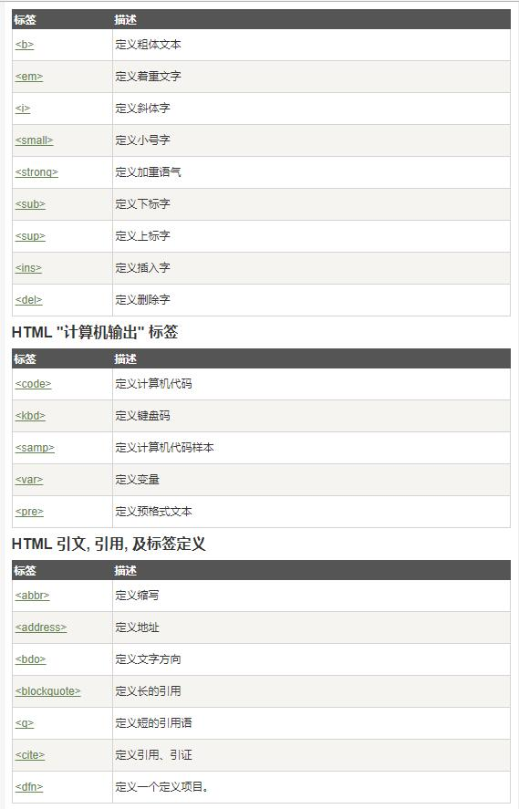

# 2.简单标签元素讲解 

## 2.1 HTML 元素简介

- HTML 元素的语法 开始标签比如\
和结束标签比如\

- HTML 元素的嵌套  \<body>\
\
\<\body>
- HTML 空元素  \
\

- HTML 元素对大小写不敏感。\
\
  \
\

## 2.2 HTML 属性
HTML属性的定义与描述。
通过链接元素来练习HTML属性<a href="http://www.runoob.com">这是一个链接</a>

HTML 属性参考手册，了解常用的属性。

    
## 2.3 HTML 标题

- HTML 标题 \<h1>-\<h6>演练
- HTML 水平线 \

- HTML 注释 \<!-- 这是一个注释 -->
- HTML 标签参考手册

[教程地址](http://www.runoob.com/html/html-headings.html)
## 2.4 HTML段落

- HTML 段落定义 \
\

- HTML 折行 \ 
输出-使用提醒: 连续的空格或空行都会被算作一
空格。需要注意的是，HTML 代码中的所有连续的空行（换行）也被显示为一个空格。

[教程地址](http://www.runoob.com/html/html-paragraphs.html)

## 2.5 HTML 文本格式化
HTML 格式化标签都有哪些如下图：

[教程地址](http://www.runoob.com/html/html-formatting.html)

## 2.6 HTML \<head>标签
掌握运用以下标签

[教程地址](http://www.runoob.com/html/html-head.html)

## 2.7 HTML 样式- CSS
    
- 掌握常用几种样式的设置，如：背景颜色、字体,、字体颜色、字体大小、文本对齐方式。

- 会用内联样式、内部样式、外部样式表三种形方写元素样式，且并清楚这三种样式的忧先级。
    
    
[教程地址](http://www.runoob.com/html/html-css.html#commentform)

## 2.8 HTML 图像

- 掌握 标签中常用属性。如：设置图像的高度height、宽度width、源属性src
[教程地址](http://www.runoob.com/html/html-images.html)

## 2.9 作业

- 要求1：将上一课的自我介绍里的文字添加样式，设置字体颜色和背景色，设置字体大小。

- 要求2：显示自己的照片。

- 要求3：使用链接元素跳转到浑河堡教会网站灵修页和小组聚会扫一扫页面。

    

