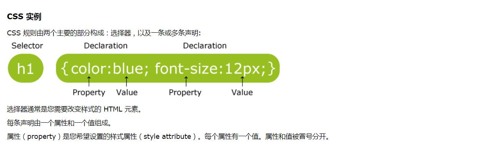

# 1.CSS基础教程
##   1.1 什么是CSS
- CSS 指层叠样式表 (Cascading Style Sheets)
- 样式定义如何显示 HTML 元素
- 样式通常存储在样式表中
- 把样式添加到 HTML 4.0 中，是为了解决内容与表现分离的问题
- 外部样式表可以极大提高工作效率
- 外部样式表通常存储在 CSS 文件中
- 多个样式定义可层叠为一
- 样式对网页中元素位置的排版进行像素级精确控制
- 安装插件 Css Peek 通过此扩展，您可以跟踪样式表中    CSS    类和 id 的样式。当您右键单击 HTML 文件中的选    择器   时，   选择“Go to Definition”和“Peek”将会直接带   您跳转到相对   应的 CSS 代码

## 1.2 样式层叠次序
样式层叠就是对一个元素多次设置同一个样式，这将使用最后一次设置的属性值。
## 1.3 CSS语法

## 1.4 CSS 注释
- 以\/* 开头     以*\/结尾
## 1.5 常见选择器
- 元素选择器
- id选择器
- class选择器
- 属性选择器
## 1.6 关于CSS文件
- CSS 文件的扩展名是.css。
- CSS 同样支持Emmet快捷方式输入。
- CSS 文件应该怎样放置到HTML里呢？
[示例代码](code/1.6-创建css文件.html)
## 1.7 作业
- 在个人空间里加入自的喜欢的音频和视频。
- 把以利亚logo加进去，把浑河堡教会编程培训班，
  文字加在主页上。
- 把本节课所学相关技术运用到作业，比如设置字体和颜色。

