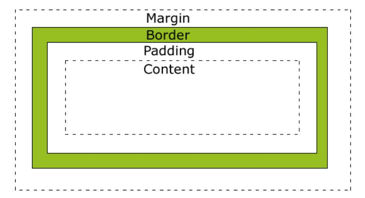

# 第3课 盒子模型
## 盒子模型简介
所有HTML元素可以看作盒子，在CSS中，"box model"这一术语是用来设计和布局时使用。
CSS盒模型本质上是一个盒子，封装周围的HTML元素，它包括：边距，边框，填充，和实际内容。
盒模型允许我们在其它元素和周围元素边框之间的空间放置元素。
下面的图片说明了盒子模型(Box Model)：

## 盒子模型说明
- Margin（外边距） - 清除边框区域。Margin没有背景颜色，它是完全透明
- Border（边框） - 边框周围的填充和内容。边框是受到盒子的背景颜色影响
- Padding（内边距） -清除内容周围的区域。会受到框中填充的背景颜色影响
- Content（内容） - 盒子的内容，显示文本和图像

[3.1-盒子模型实例](3.1-盒子模型实例.html)

[3.2-CSS边框属性](3.2-CSS边框属性.html)

[3.3-边框宽度]([3.3-边框宽度.html)

## CSS 轮廓（outline）属性

CSS Outlines

轮廓（outline）是绘制于元素周围的一条线，位于边框边缘的外围，可起到突出元素的作用。
轮廓（outline）属性指定了样式，颜色和外边框的宽度。
轮廓（outline）属性的位置让它不像边框那样参与到文档流中，因此轮廓出现或消失时不会影响文档流，即不会导致文档的重新显示。

CSS 轮廓（outline）

轮廓（outline）是绘制于元素周围的一条线，位于边框边缘的外围，可起到突出元素的作用。
CSS outline 属性规定元素轮廓的样式、颜色和宽度。

