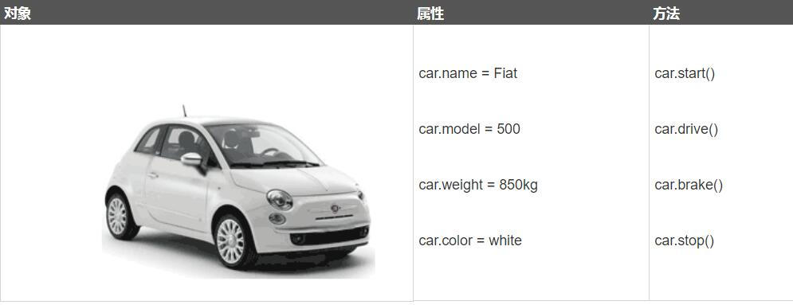
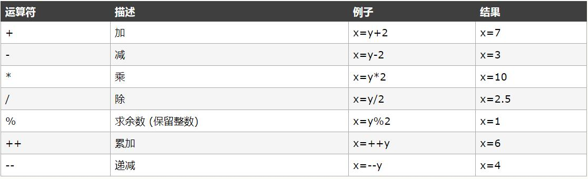
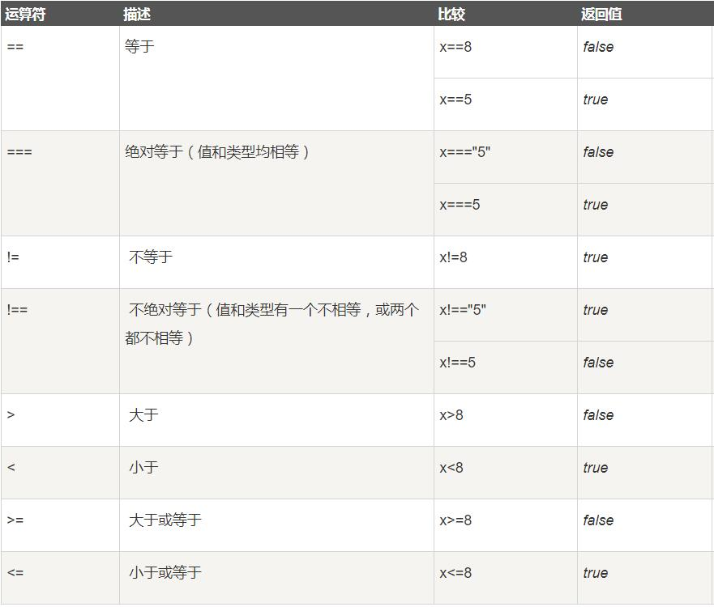
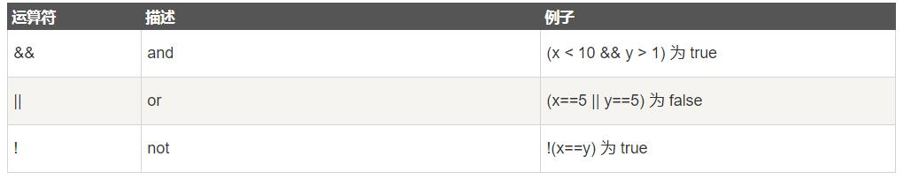

# JavaScript 教程
## 2.JavaScript 基础
## 2.1 JavaScript 变量
变量是用于存储信息的"容器"。
如：var x=2;
   var y=3;
   var z=x+y;
- 变量必须以字母开头
- 变量也能以 $ 和 _ 符号开头（不过我们不推荐这么做）
- 变量名称对大小写敏感（y 和 Y 是不同的变量）
## 2.2 JavaScript 数据类型
JavaScript 字符串
- 字符串是存储字符（比如 "Bill Gates"）的变量。
- 字符串可以是引号中的任意文本。您可以使用单引号或双引号：
实例
- var carname="Bill Gates";
- var carname='Bill Gates';

JavaScript 数字
JavaScript 只有一种数字类型。数字可以带小数点，也可以不带：
实例
- var x1=34.00;      //使用小数点来写
- var x2=34;         //不使用小数点来写
极大或极小的数字可以通过科学（指数）计数法来书写：

JavaScript 布尔
- 布尔（逻辑）只能有两个值：true 或 false。
- var x=true
- var y=false
布尔常用在条件测试中。您将在本教程稍后的章节中学到更多关于条件测试的知识。

JavaScript 数组
下面的代码创建名为 cars 的数组：
- var cars=new Array();
- cars[0]="Audi";
- cars[1]="BMW";
- cars[2]="Volvo";
  或者 (condensed array):
  var cars=new Array("Audi","BMW","Volvo");
  或者 (literal array):
实例
- var cars=["Audi","BMW","Volvo"];

JavaScript 对象
- 对象由花括号分隔。在括号内部，对象的属性以名称和值对的形式 (name : value) 来定义。属性由    逗号分隔：
  
  以下属于教学内容，请不要转发，以免误会！
  var person={name:"二叔", EliglishName:"Paul", id:1234567890X,size:"3"，height:"178cm",weight:"100",Gender:"Male"};
  
  var person={name:"xxx姐妹",height:"165cm",weight:"110",edu:"念过神学最好"，other:"如果学过编程或者从事相关行业更好",Gender:"Female"}

  上面例子中的对象 (person) 有个属性：name, id等。
  空格和折行无关紧要。声明可横跨多行：
  var person={
  firstname : "Bill",
  lastname  : "Gates",
  id        :  5566
  };
- 对象属性有两种寻址方式：
实例
- name=person.lastname;
- name=person["lastname"];

Undefined 和 Null
- Undefined 这个值表示变量不含有值。
可以通过将变量的值设置为 null 来清空变量。
实例
- cars=null;
- person=null;

## 2.3 声明变量类型
当您声明新变量时，可以使用关键词 "new" 来声明其类型：
- var carname=new String;
- var x=new Number;
- var y=new Boolean;
- var cars=new Array;
- var person=new Object;
JavaScript 变量均为对象。当您声明一个变量时，就创建了一个新的对象。

JavaScript 中的所有事物都是对象：字符串、数字、数组、日期，等等。
在 JavaScript 中，对象是拥有属性和方法的数据。

## 2.4 属性和方法
- 属性是与对象相关的值。
- 方法是能够在对象上执行的动作。
举例：汽车就是现实生活中的对象。

汽车的属性：
- car.name=Fiat

- car.model=500

- car.weight=850kg

- car.color=white 
汽车的方法：
- car.start()

- car.drive()

- car.brake()
汽车的属性包括名称、型号、重量、颜色等。
所有汽车都有这些属性，但是每款车的属性都不尽相同。
汽车的方法可以是启动、驾驶、刹车等。
所有汽车都拥有这些方法，但是它们被执行的时间都不尽相同。

## 2.5 JavaScript 中的对象

在 JavaScript 中，对象是数据（变量），拥有属性和方法。
当您像这样声明一个 JavaScript 变量时：
- var txt = "Hello";
- 您实际上已经创建了一个 JavaScript 字符串对象。字符串对象拥有内建的属性 length。对于上面的   字符串来说，length 的值是 5。字符串对象同时拥有若干个内建的方法。
属性：
- txt.length=5
方法：
- txt.indexOf()

- txt.replace()

- txt.search()
提示：在面向对象的语言中，属性和方法常被称为对象的成员。
在本教程稍后的章节中，您将学到有关字符串对象的更多属性和方法。

## 2.6 函数
函数是由事件驱动的或者当它被调用时执行的可重复使用的代码块。 
JavaScript 函数语法 
函数就是包裹在花括号中的代码块，前面使用了关键词 function： 
function functionname() 
\{ 
这里是要执行的代码 
\} 
当调用该函数时，会执行函数内的代码。 
可以在某事件发生时直接调用函数（比如当用户点击按钮时），并且可由 JavaScript 在任何位置进行调用。 
提示：JavaScript 对大小写敏感。关键词 function 必须是小写的，并且必须以与函数名称相同的大小写来调用函数。 
调用带参数的函数 
在调用函数时，您可以向其传递值，这些值被称为参数。 
这些参数可以在函数中使用。 
您可以发送任意多的参数，由逗号 (,) 分隔： 
myFunction(argument1,argument2) 
当您声明函数时，请把参数作为变量来声明： 
function myFunction(var1,var2) 
{ 
这里是要执行的代码 
} 
变量和参数必须以一致的顺序出现。第一个变量就是第一个被传递的参数的给定的值，以此类推。 
实例 
\<button onclick=\"myFunction(\'Bill Gates\',\'CEO\')\">点击这里\<\/button\>

\<script\>
function myFunction(name,job)
\{
alert("Welcome " + name + ", the " + job);
\}
\</script\>
## 2.7 JavaScript 运算符
运算符 = 用于赋值。 
运算符 + 用于加值。 
运算符 = 用于给 JavaScript 变量赋值。 
算术运算符 + 用于把值加起来。 
y=5; 
z=2; 
x=y+z;  
在以上语句执行后，x 的值是 7。 
JavaScript 算术运算符 
算术运算符用于执行变量与/或值之间的算术运算。 
给定 y=5，下面的表格解释了这些算术运算符： 

## 2.8 JavaScript 事件
HTML 事件是发生在 HTML 元素上的事情。 
当在 HTML 页面中使用 JavaScript 时， JavaScript 可以触发这些事件。 
HTML 事件 
HTML 事件可以是浏览器行为，也可以是用户行为。 
以下是 HTML 事件的实例： 
HTML 页面完成加载 
HTML input 字段改变时 
HTML 按钮被点击 

## 2.9 比较运算符
JavaScript 比较 和 逻辑运算符 
比较和逻辑运算符用于测试 true 或者 false。 

## 2.10 逻辑运算符
逻辑运算符用于测定变量或值之间的逻辑。
给定 x=6 以及 y=3，下表解释了逻辑运算符：

## 2.11 条件运算符
实例 
如果变量 age 中的值小于 18，则向变量 voteable 赋值 "年龄太小"，否则赋值 "年龄已达到"。

## 2.12 JavaScript If...Else 语句

条件语句 
通常在写代码时，您总是需要为不同的决定来执行不同的动作。您可以在代码中使用条件语句来完成该任务。 
在 JavaScript 中，我们可使用以下条件语句： 
- if 语句 - 只有当指定条件为 true 时，使用该语句来执行代码
- if...else 语句 - 当条件为 true 时执行代码，当条件为 false 时执行其他代码
- if...else if....else 语句- 使用该语句来选择多个代码块之一来执行
- switch 语句 - 使用该语句来选择多个代码块之一来执
## 2.13 switch
JavaScript switch 语句

请使用 switch 语句来选择要执行的多个代码块之一。 
你可以在JavaScript编程实战中了解怎么使用switch语句进行多选项选择。 
语法

 switch(n) 
 \{
 case 1: 
  执行代码块 1 
 break; 
 case 2: 
  执行代码块 2 
 break; 
 default: 
 n 与 case 1 和 case 2 不同时执行的代码
 \}
工作原理：首先设置表达式 n（通常是一个变量）。随后表达式

## 2.14 JavaScript for 循环
JavaScript 循环 
如果您希望一遍又一遍地运行相同的代码，并且每次的值都不同，那么使用循环是很方便的。

## 2.15 JavaScript while 循环

JavaScript while 循环 

JavaScript while 循环的目的是为了反复执行语句或代码块。 
只要指定条件为 true，循环就可以一直执行代码块。 
while 循环 

while 循环会在指定条件为真时循环执行代码块。 
语法 

 while (条件) 
   \{ 
  需要执行的代码 
   \} 

## 2.16 JavaScript Break 和 Continue 语句

break 语句用于跳出循环。 
continue 用于跳过循环中的一个迭代。 

Continue 语句 

continue 语句中断循环中的迭代，如果出现了指定的条件，然后继续循环中的下一个迭代。  

## 2.17 类型转换

JavaScript 类型转换 

Number() 转换为数字， String() 转换为字符串， Boolean() 转化为布尔值。 
JavaScript 数据类型 

在 JavaScript 中有 5 种不同的数据类型： 
- string
- number
- boolean
- object
- function
3 种对象类型：
- Object
- Date
- Array
2 个不包含任何值的数据类型：
- null
- undefined

## 2.18 typeof 操作符

你可以使用 typeof 操作符来查看 JavaScript 变量的数据类型。